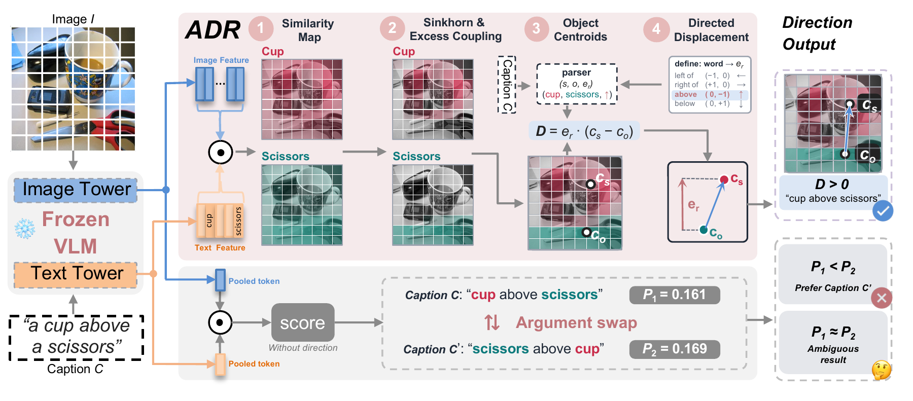

# Readout Blindness: VLM Scores Miss the Spatial Direction Their Frozen Encoders Retain

[](https://arxiv.org/abs/2610.06324)

Code for the preprint [arXiv:2610.06324](https://arxiv.org/abs/2610.06324) by Guangyuan Li, Tianming Du, Yan Jiang, Bihan Wen, and Jiancheng Yang.

This repository provides **Antisymmetric Displacement Readout (ADR)** and the **prior-deflated evaluation kit**.

ADR estimates object locations from a frozen vision-language model and reads relation direction from their signed centroid displacement. It requires no additional training or learned parameters. The evaluation kit compares readouts under original and unrelated image-caption pairings to measure grounded gain.

[Installation](#installation) · [Data](#data) · [Run](#run) · [Evaluation](#evaluation) · [Code](#code) · [Citation](#citation)

## ADR

[](assets/pipeline.pdf)

*ADR and the deployed score use the same frozen VLM. ADR makes object locations explicit and reads their relative direction.*

The default variant, **ADR-excess**, retains coupling mass above the uniform baseline. **ADR-dense** instead normalizes patch weights independently for each word. Both use the same displacement score:

$$
D(C) = \sum_r \mathbf{e}_r^\top
\left(\mathbf{c}_{s_r} - \mathbf{c}_{o_r}\right).
$$

Here, the centroids locate the subject and object, and the axis specifies the positive direction of the relation. Front/behind relations use image height as a depth proxy. The implementation also includes `pi0` and `argmax` weights for comparisons.

## Installation

Run commands from the repository root:

```bash
python -m pip install -r requirements.txt
python -m spacy download en_core_web_sm
```

Dual encoders load through `open_clip`; matching heads and MLLMs load through `transformers`. The selected model downloads on first use. Set `ADR_CACHE_DIR` to choose the dual-encoder cache location.

For the compositional fine-tunes, obtain the checkpoints from their respective releases and set the matching environment variable:

| Model | Checkpoint variable |
|---|---|
| NegCLIP | `ADR_CKPT_NEGCLIP` |
| CLoVe | `ADR_CKPT_CLOVE` |
| CE-CLIP | `ADR_CKPT_CECLIP` |

## Data

The repository includes **item lists and manifests**. Download benchmark images from their original sources; images are not redistributed here.

| Benchmark | Required data |
|---|---|
| VG-Relation / ARO | Parquet shards of `gowitheflow/ARO-Visual-Relation` in the hub cache selected by `ADR_CACHE_DIR` or `HF_HOME` |
| What'sUp | `controlled_images_dataset.json`, `controlled_clevr_dataset.json`, and their `controlled_images/` and `controlled_clevr/` image folders |
| COCO-spatial | What'sUp's `coco_qa_two_obj.json` and COCO `val2017/` images |
| VSR | `random_train.jsonl`, `random_dev.jsonl`, `random_test.jsonl`, and `images/` |
| VALSE actant swap | `actant-swap.json` and the corresponding SWiG images |

The supplied configurations expect this layout:

```text
data/
  items/                      # shipped item lists and null partners
  manifests/                  # shipped paths and caption candidates
  whatsup/
    controlled_images/
    controlled_clevr/
  coco/val2017/
  vsr/
    random_train.jsonl
    random_dev.jsonl
    random_test.jsonl
    images/
  valse/actant-swap.json
  swig/images_512/
```

Place the What'sUp annotation files under `data/whatsup/` if rebuilding the manifests. Other locations can be set through `data_root`, `vsr_root`, `valse_json`, and `swig_root` in the YAML configuration. VG-Relation uses a fixed 6000-item sample drawn with `numpy.random.default_rng(0)` in parquet-shard order.

The shipped files serve two purposes:

- [`data/manifests/`](data/manifests/) supplies the image paths and caption candidates used by the What'sUp and COCO-spatial loaders.
- [`data/items/`](data/items/) records evaluation order, source-image identifiers, captions, labels, coverage flags, subset labels where applicable, and null partners. These are exported records; the runner loads each benchmark through its data loader.

## Run

After preparing the data, evaluate deployed CLIP and both main ADR variants under real and null pairings:

```bash
python scripts/run.py configs/adr_clip_b16.yaml
```

For a short first run on COCO-spatial:

```bash
python scripts/run.py configs/adr_clip_b16.yaml --sets coco_spatial --passes real --limit 10
```

`--limit` is for smoke tests. Omit it for reported results; applying a limit also changes the image pool used by a null pass. Use `--device` to select a device, such as `cuda:0` or `cpu`.

### Experiment configurations

| Configuration | Readouts |
|---|---|
| [`adr_clip_b16.yaml`](configs/adr_clip_b16.yaml) | Deployed CLIP ViT-B/16, ADR-excess, ADR-dense |
| [`adr_siglip2.yaml`](configs/adr_siglip2.yaml) | Deployed SigLIP2, ADR-excess, ADR-dense |
| [`halfcrop.yaml`](configs/halfcrop.yaml) | Half-crop on CLIP and SigLIP2 |
| [`matching_heads.yaml`](configs/matching_heads.yaml) | BLIP base/large, BLIP-2 and FLAVA matching heads |
| [`mllm_qwen36.yaml`](configs/mllm_qwen36.yaml) | Qwen3.6 likelihood and chat |
| [`prior_biased.yaml`](configs/prior_biased.yaml) | Deployed CLIP, NegCLIP and SigLIP2, plus LLaVA-1.5 likelihood on the prior-analysis sets |

To customize a run, edit the configuration or override its sets and passes on the command line. For example:

```yaml
readouts:
  - {readout: deployed, model: clip_b16}
  - {readout: adr, model: clip_b16, variant: excess}
  - {readout: adr, model: clip_b16, variant: dense}
sets: [coco_spatial, whatsup_a]
passes: [real, "null"]
data_root: data
out: results/example
```

Keep `"null"` quoted in YAML. Available readout names are listed in [`readouts/__init__.py`](readouts/__init__.py), and encoder tags in [`adr/features.py`](adr/features.py).

### Outputs

Each run writes to the configuration's `out` directory:

| File | Contents |
|---|---|
| `<set>__<readout>.json` | Real accuracy and sample counts by subset |
| `<set>__<readout>__null.json` | Null accuracy and sample counts by subset |
| Corresponding `*.items.jsonl` files | Per-item scores or chat replies, labels and coverage |
| `summary.json` | Real accuracy, null accuracy and grounded gain when both passes run |

The summary reports accuracies in percent and grounded gain in percentage points.

## Evaluation

**Prior deflation** compares performance with the original images against a deterministic unrelated-image control:

$$
\mathrm{grounded\ gain} = \mathrm{accuracy}_{\mathrm{real}} - \mathrm{accuracy}_{\mathrm{null}}.
$$

The difference measures the benefit of the original pairing relative to this control. Null partners use a cyclic offset, advancing when the source image matches: `K = 997` for VG-Relation and What'sUp-B, and `K = 101` otherwise. What'sUp-B's left/right and front/behind groups receive separate assignments.

### Reported subsets

| Role | Subset | Scored items |
|---|---|---:|
| Direction-balanced | VG-Relation left/right | 3918 |
| Direction-balanced | COCO-spatial | 404 |
| Direction-balanced | What'sUp-A | 408 |
| Direction-balanced | What'sUp-B | 354 |
| Direction-balanced | VSR horizontal | 1201 |
| Prior analysis | VG-Relation vertical | 800 |
| Prior analysis | VG-Relation verbs | 408 |
| Prior analysis | VALSE actant swap | 949 |

Raw lists may contain additional items or strata used by the null assignments. K-way and true/false evaluations apply the same caption-coverage test to every readout. Pair evaluations retain all items in the reported stratum; ADR returns zero for captions with no parsed relation.

### Scoring rules

- **Candidate captions:** select the highest score. Ties within `1e-9` receive half credit for pairs or equal credit among tied winners for k-way questions.
- **VSR:** ADR uses the sign of its displacement; half-crop uses the sign of its subject-object swap margin. Scores without a canonical zero use an oracle threshold optimized **separately for real and null pairings**.
- **Chat:** candidate questions are evaluated in both original and reversed order, then averaged. Unparsable replies receive uniform credit. VSR uses a yes/no question.

Recompute the random-guess rows with:

```bash
python -m evalkit.random_guess
```

This uses 10,000 uniform draws. Data-loading and scoring details are in [`evalkit/sets.py`](evalkit/sets.py) and [`evalkit/protocol.py`](evalkit/protocol.py).

## Code

| Location | Purpose |
|---|---|
| [`adr/`](adr/) | Frozen feature extraction, relation parsing, Sinkhorn coupling and displacement scoring |
| [`readouts/`](readouts/) | Deployed scores, ADR, half-crop, matching heads and MLLM readouts |
| [`evalkit/`](evalkit/) | Dataset loaders, null assignments, decision rules and result summaries |
| [`configs/`](configs/) | Experiment configurations |
| [`scripts/`](scripts/) | Evaluation entry point, manifest building, item-list export and reference comparisons |

To rebuild manifests or export item lists, see [`build_manifests.py`](scripts/build_manifests.py) and [`export_lists.py`](scripts/export_lists.py). The `smoke_compare` scripts compare generated scores with supplied reference records.

## Citation

If you use this code, please cite the preprint:

```bibtex
@misc{li2026readoutblindness,
  title         = {Readout Blindness: {VLM} Scores Miss the Spatial Direction Their Frozen Encoders Retain},
  author        = {Guangyuan Li and Tianming Du and Yan Jiang and Bihan Wen and Jiancheng Yang},
  year          = {2026},
  eprint        = {2610.06324},
  archivePrefix = {arXiv},
  primaryClass  = {cs.CV},
  url           = {https://arxiv.org/abs/2610.06324}
}
```

## License

Code is released under the [MIT License](LICENSE). Datasets and pretrained checkpoints retain their respective licenses.
